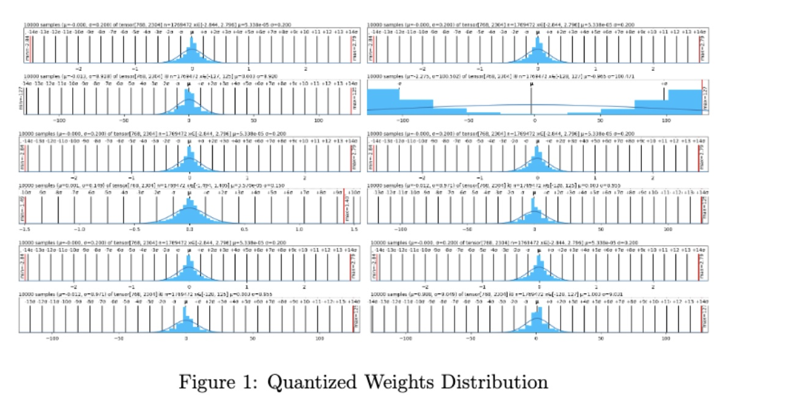

# LLMEasyQuant

LLMEasyQuant is a package developed for Easy Quantization Deployment for LLM applications. Nowadays, packages like TensorRT and Quanto have many underlying structures and self-invoking internal functions, which are not conducive to developers' personalized development and learning for deployment. LLMEasyQuant is developed to tackle this problem.

Author: Dong Liu, Meng Jiang, Kaiser Pister

### Deployment Methods:
#### Define the model
```python
from transformers import AutoModelForCausalLM, AutoTokenizer
from transformers import BitsAndBytesConfig


# Set device to CPU for now
device = 'cpu'
# device = 'cuda' if torch.cuda.is_available() else 'cpu'

# Load model and tokenizer
model_id = 'gpt2'  # 137m F32 params
# model_id = 'facebook/opt-1.3b' # 1.3b f16 params
# model_id = 'mistralai/Mistral-7B-v0.1'  # 7.24b bf16 params, auth required
# model_id = 'meta-llama/Llama-2-7b-hf' # auth required

model = AutoModelForCausalLM.from_pretrained(model_id).to(device)
tokenizer = AutoTokenizer.from_pretrained(model_id)

model_int8 = AutoModelForCausalLM.from_pretrained(model_id,
                                                  device_map='auto',
                                                  quantization_config=BitsAndBytesConfig(
                                                      load_in_8bit=True)
                                                  )
model_int8.name_or_path += "_int8"
```

#### mode deployment
absmax
```python
absq = Quantizer(model, tokenizer, absmax_quantize)
quantizers.append(absq)
```

zeropoint
```python
zpq = Quantizer(model, tokenizer, zeropoint_quantize)
quantizers.append(zpq)
```

smoothquant
```python
smooth_quant = SmoothQuantMatrix(alpha=0.5)
smoothq = Quantizer (model, tokenizer, smooth_quant.smooth_quant_apply)
quantizers.append(smoothq)
```

simquant
```python
simq = Quantizer(model, tokenizer, sim_quantize )
quantizers.append(simq)
```

simquant, zeroquant and knowledge distllation of both each
```python
symq = Quantizer(model, tokenizer, sym_quantize_8bit)
zeroq = Quantizer(model, tokenizer, sym_quantize_8bit, zeroquant_func)
quantizers.extend([symq, zeroq])
```

#### model computation
```python
[q.quantize() for q in quantizers]
```

#### visualization
```python
dist_plot([model, model_int8] + [q.quant for q in quantizers])
```

#### model comparision
```python
generated = compare_generation([model, model_int8] + [q.quant for q in quantizers], tokenizer, max_length=200, temperature=0.8)
```

#### perplexity analysis
```python
ppls = compare_ppl([model, model_int8] + [q.quant for q in quantizers], tokenizer, list(generated.values()))
```


### Results:

<!--  -->
<!-- {width=500px} -->
<p align="center">
  
</p>
<p align="center">
  
</p>
<!--  -->
<p align="center">
  
</p>


### Conclusion:
In the research, we develop LLMEasyQuant, it is a package aiming to for easy quantization deployment which is user-friendly and easy to be deployed when computational resouces is limited.

### Citation
If you find LLMEasyQuant useful or relevant to your project and research, please kindly cite our paper:

```
@article{liu2024llmeasyquanteasyuse,
      title={LLMEasyQuant -- An Easy to Use Toolkit for LLM Quantization}, 
      author={Dong Liu and Meng Jiang and Kaiser Pister},
      year={2024},
      eprint={2406.19657},
      archivePrefix={arXiv},
      primaryClass={cs.LG},
      url={https://arxiv.org/abs/2406.19657}, 
}
```

