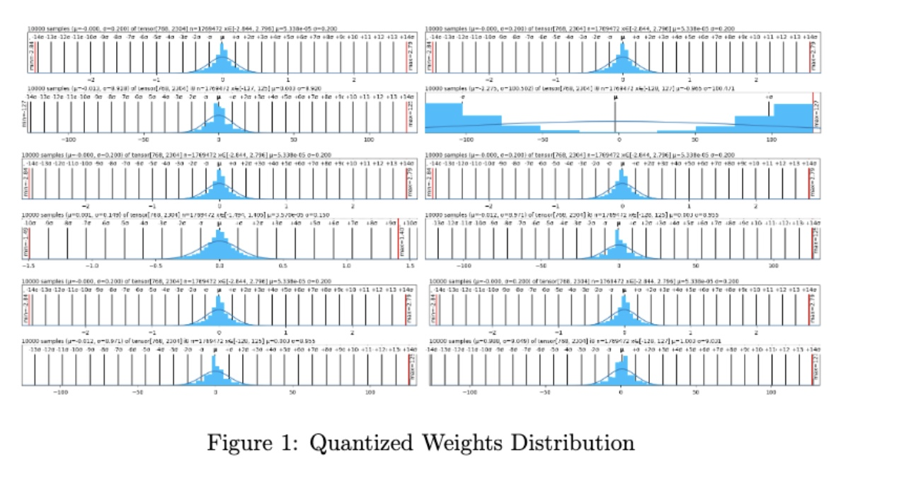
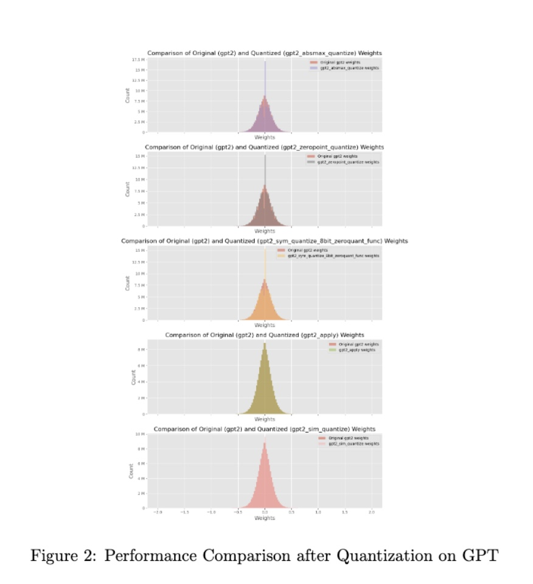
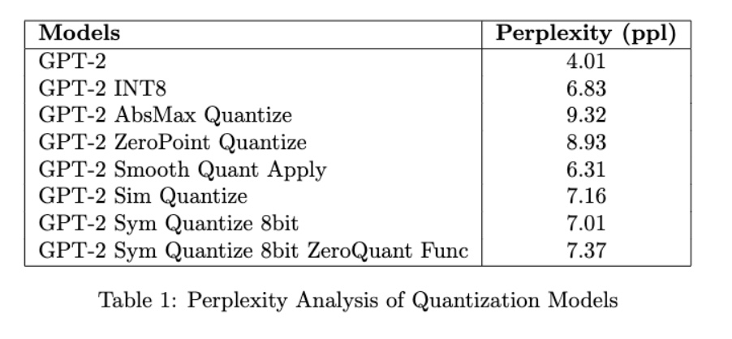

# LLMEasyQuant

LLMEasyQuant is a package developed for Easy Quantization Deployment for LLM applications.

Author: Dong Liu, Meng Jiang, Kaiser Pister

### Deployment Methods:
#### Define the model
```
from transformers import AutoModelForCausalLM, AutoTokenizer
from transformers import BitsAndBytesConfig


# Set device to CPU for now
device = 'cpu'
# device = 'cuda' if torch.cuda.is_available() else 'cpu'

# Load model and tokenizer
model_id = 'gpt2'  # 137m F32 params
# model_id = 'facebook/opt-1.3b' # 1.3b f16 params
# model_id = 'mistralai/Mistral-7B-v0.1'  # 7.24b bf16 params, auth required
# model_id = 'meta-llama/Llama-2-7b-hf' # auth required

model = AutoModelForCausalLM.from_pretrained(model_id).to(device)
tokenizer = AutoTokenizer.from_pretrained(model_id)

model_int8 = AutoModelForCausalLM.from_pretrained(model_id,
                                                  device_map='auto',
                                                  quantization_config=BitsAndBytesConfig(
                                                      load_in_8bit=True)
                                                  )
model_int8.name_or_path += "_int8"
```
#### mode deployment
absmax
```
absq = Quantizer(model, tokenizer, absmax_quantize)
quantizers.append(absq)
```
zeropoint
```
zpq = Quantizer(model, tokenizer, zeropoint_quantize)
quantizers.append(zpq)
```
smoothquant
```
smooth_quant = SmoothQuantMatrix(alpha=0.5)

smoothq = Quantizer (model, tokenizer, smooth_quant.smooth_quant_apply)
quantizers.append(smoothq)
```
simquant
```
simq = Quantizer(model, tokenizer, sim_quantize )
quantizers.append(simq)
```

simquant, zeroquant and knowledge distllation of both each
```
symq = Quantizer(model, tokenizer, sym_quantize_8bit)
zeroq = Quantizer(model, tokenizer, sym_quantize_8bit, zeroquant_func)
quantizers.extend([symq, zeroq])
```

#### model computation
```
[q.quantize() for q in quantizers]
```

#### visualization
```
dist_plot([model, model_int8] + [q.quant for q in quantizers])
```

#### model comparision
```
generated = compare_generation([model, model_int8] + [q.quant for q in quantizers], tokenizer, max_length=200, temperature=0.8)
```

#### perplexity analysis
```
ppls = compare_ppl([model, model_int8] + [q.quant for q in quantizers], tokenizer, list(generated.values()))
```


Results:




Conclusion:
In the research, we develop LLMEasyQuant, it is a package aiming to for easy quantization deployment which is user-friendly and suitable for beginners' learning.

